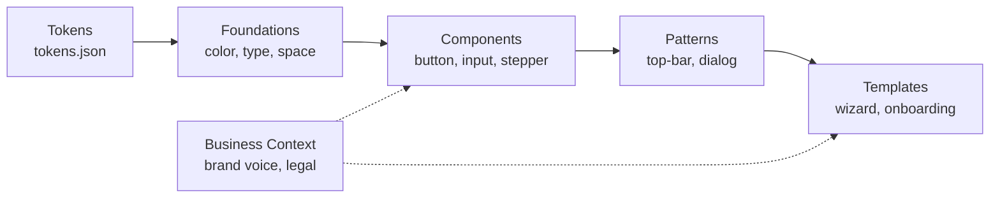

# ACH Design System

**Status: ongoing.** An agent-oriented design system scaffold and source of truth for product UI, design tokens, component specifications, and brand interaction rules.

Both human engineers and AI coding agents (Cursor, Antigravity, Claude Code, GitHub Copilot) should follow these files instead of inventing one-off styles, layout primitives, or unapproved copy.

---

## 🚀 Quick Navigation

- **🤖 AI Agent Instructions**: See [`AGENTS.md`](AGENTS.md) for negative constraints, token resolutions, and decision trees.
- **✨ Design Taste & Anti-Slop**: See [`foundations/taste.md`](foundations/taste.md) and [`.agents/skills/ach-taste/SKILL.md`](.agents/skills/ach-taste/SKILL.md) for enterprise UI standards, dials, and bias corrections.
- **📦 Practical Integration Guide**: See [`docs/integration-guide.md`](docs/integration-guide.md) for how to use this repository in other apps (Git Submodule, Cursor rules, Tailwind config, and Figma sync).
- **🎨 Component Template**: See [`components/COMPONENT_TEMPLATE.md`](components/COMPONENT_TEMPLATE.md) for standardizing new components extracted from Figma.
- **🔌 Figma Plugin PRD**: See [`docs/prd-figma-plugin.md`](docs/prd-figma-plugin.md) for the product requirements to automate exporting Figma tokens & components into this repo.

---

## System Architecture



| Layer | What it is | Status |
| :--- | :--- | :--- |
| [Tokens](tokens/tokens.json) | W3C DTCG-compliant values for color, type, space, radius | Active |
| [Foundations](foundations/color.md) | How tokens combine (accessibility, color roles, spacing) | Draft |
| [Components](components/components.md) | Single UI primitives and code contracts (Button, Input, Stepper) | Draft |
| [Patterns](patterns/patterns.md) | Recurring compound layouts (Top bar, Bottom action bar, Dialog) | Draft |
| [Templates](templates/templates.md) | Full screen & user flows (Wizard, Onboarding) | Draft |
| [Business Context](business-context/product-overview.md) | Product facts, voice, unit rules, and legal constraints | Placeholder |

---

## 🛠️ How to Consume in Other Projects

For in-depth setup, read the full [`docs/integration-guide.md`](docs/integration-guide.md). A quick summary:

### Option 1: Git Submodule (Recommended)
Add this repo directly inside your downstream frontend project to give your local IDE and AI agents instant context:
```bash
git submodule add https://github.com/arioseno-ach/ach-design-system.git docs/design-system
git submodule update --init --recursive
```
Import tokens in your application CSS:
```css
@import "../docs/design-system/tokens/tokens.css";
```

### Option 2: AI Agent Rules (Cursor / Antigravity / Claude)
Configure your project's `.cursor/rules/ach-design-system.mdc` or `.agents/skills/` to point to `docs/design-system/AGENTS.md`. This prevents agents from hardcoding arbitrary hex colors or pixel spacing.

---

## 📐 Layering Rules

| Layer | Purpose | Do Not |
| :--- | :--- | :--- |
| **Tokens** | Raw design values (`$value`, `$type`) | Hardcode values inside components |
| **Foundations** | How tokens are applied & contrast guidelines | Redefine raw token values |
| **Components** | Single atomic UI controls | Encode full page flows or business logic |
| **Patterns** | Recurring layouts composed of components | Duplicate component specifications |
| **Templates** | Complete screen flows and wizards | Redefine components or patterns |

---

## 📂 File Map

| Path | Role |
| :--- | :--- |
| [`AGENTS.md`](AGENTS.md) | **Primary operating instructions for AI coding assistants** |
| [`docs/integration-guide.md`](docs/integration-guide.md) | **Step-by-step practical guide to consume this repo in apps** |
| [`docs/prd-figma-plugin.md`](docs/prd-figma-plugin.md) | **PRD for Figma Plugin (Auto-export Tokens & Component MD)** |
| [`design.md`](design.md) | Global rules, design principles, and brand voice |
| [`tokens/`](tokens/tokens.json) | `tokens.json` (source) and `tokens.css` (generated CSS variables) |
| [`foundations/`](foundations/color.md) | Color, typography, spacing, accessibility, and [Design Taste](foundations/taste.md) |
| [`components/`](components/components.md) | Component registry + per-component contracts and specs |
| [`components/COMPONENT_TEMPLATE.md`](components/COMPONENT_TEMPLATE.md) | Blueprint for extracting Figma components into markdown specs |
| [`patterns/`](patterns/patterns.md) | Registry + layout pattern specs |
| [`templates/`](templates/templates.md) | Registry + flow templates |
| [`business-context/`](business-context/product-overview.md) | Ecosystem overview + [OnlinePajak](business-context/onlinepajak.context.md), [Credor](business-context/credor.context.md), [Covia](business-context/covia.context.md) |
| [`changelog/corrections-log.md`](changelog/corrections-log.md) | Rolling log of corrections and system updates |

---

## 📋 Backlog & Next Steps

- [x] Document business context for Achilles ecosystem, OnlinePajak, Credor, and Covia.
- [ ] Sync Figma styles into [`tokens/tokens.json`](tokens/tokens.json) and generate compiled `tokens.css`.
- [ ] Extract remaining Figma components using [`components/COMPONENT_TEMPLATE.md`](components/COMPONENT_TEMPLATE.md).
- [ ] Promote draft components, patterns, and templates as they pass review.
