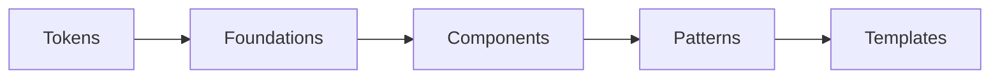

# ACH Design System

**Status: ongoing.** This is a working scaffold, not a finished library. Specs, tokens, and product context will keep changing as the system is filled in.

Source of truth for product UI, language, and interaction rules. Agents and humans should follow these files instead of inventing one-off styles or copy.

## What’s here

| Layer | What it is | Status |
| --- | --- | --- |
| [Tokens](tokens/tokens.json) | Color, type, space, radius | Draft |
| [Foundations](foundations/color.md) | How tokens are used | Draft |
| [Components](components/components.md) | Button, input, stepper | Draft |
| [Patterns](patterns/patterns.md) | Top bar, bottom bar, dialog | Draft |
| [Templates](templates/templates.md) | Wizard, onboarding | Draft |
| [Business context](business-context/product-overview.md) | Product facts, voice, unit rules | Placeholder — fill in before shipping UI |

## How to use this repo

1. Read [`design.md`](design.md) for global rules, brand voice, and principles.
2. Check [`business-context/`](business-context/product-overview.md) so copy and flows match the product.
3. Use [`tokens/`](tokens/tokens.json) as the only source of visual values. Do not invent hex, type sizes, or spacing.
4. Prefer existing [`components/`](components/components.md) and [`patterns/`](patterns/patterns.md) over new one-offs.
5. Compose screens from [`templates/`](templates/templates.md) when a flow already exists.
6. If you find a mistake or missing rule, append it to [`changelog/corrections-log.md`](changelog/corrections-log.md) and fold the correction back into the matching rule file.

## Layering

| Layer | Purpose | Do not |
| --- | --- | --- |
| Tokens | Raw values | Hardcode values in components |
| Foundations | How tokens are used | Redefine token values |
| Components | Single UI primitives | Encode full page flows |
| Patterns | Recurring layouts of components | Duplicate component specs |
| Templates | Full flows | Redefine components or patterns |

## File map

| Path | Role |
| --- | --- |
| [`design.md`](design.md) | Global rules |
| [`tokens/`](tokens/tokens.json) | `tokens.json` (source) and `tokens.css` (generated) |
| [`foundations/`](foundations/color.md) | Color, typography, spacing, accessibility |
| [`components/`](components/components.md) | Registry + per-component specs |
| [`patterns/`](patterns/patterns.md) | Registry + per-pattern specs |
| [`templates/`](templates/templates.md) | Registry + flow templates |
| [`business-context/`](business-context/product-overview.md) | Product, voice, compliance |
| [`changelog/corrections-log.md`](changelog/corrections-log.md) | Rolling corrections |

## Still to do

- Fill in product name, personas, and core flows in business context.
- Promote draft components, patterns, and templates as they are reviewed.
- Keep tokens as the only source of visual values as the system grows.
