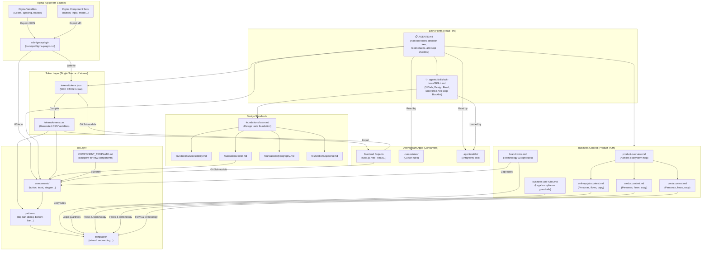
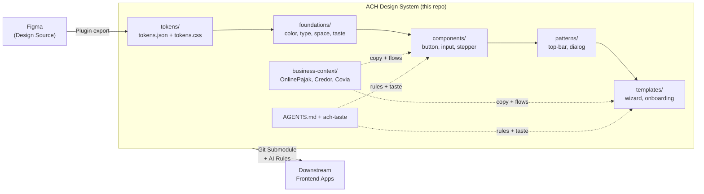

# ACH Design System

**Status: ongoing.** An agent-oriented design system scaffold and source of truth for product UI, design tokens, component specifications, and brand interaction rules across the Achilles ecosystem (OnlinePajak, Credor, Covia).

Both human engineers and AI coding agents (Cursor, Antigravity, Claude Code, GitHub Copilot) should follow these files as their single source of truth — not invent one-off styles, unapproved copy, or arbitrary layout primitives.

---

## 🚀 Quick Navigation

| File | Purpose |
| :--- | :--- |
| [`AGENTS.md`](AGENTS.md) | 🤖 Primary operating manual for AI coding agents |
| [`foundations/taste.md`](foundations/taste.md) | ✨ Enterprise design taste, anti-slop dials, and bias corrections |
| [`.agents/skills/ach-taste/SKILL.md`](.agents/skills/ach-taste/SKILL.md) | ✨ Activatable AI skill version of the taste standard |
| [`docs/integration-guide.md`](docs/integration-guide.md) | 📦 How to consume this repo in other projects |
| [`components/COMPONENT_TEMPLATE.md`](components/COMPONENT_TEMPLATE.md) | 🎨 Figma-to-Markdown component blueprint |
| [`docs/prd-figma-plugin.md`](docs/prd-figma-plugin.md) | 🔌 PRD for automated Figma token & component exporter |

---

## 🗺️ How the Repo Works (File Relationship Map)

This diagram shows how every file in the repo connects to each other and how an AI Agent is expected to navigate them:



---

## ⚙️ How an AI Agent Processes a UI Task

When an agent receives a task like *"Build the e-Faktur batch upload confirmation screen"*, this is the exact sequence of files it should read:

```
1. AGENTS.md           → Read negative rules and decision tree first
2. ach-taste/SKILL.md  → Declare "ACH Design Read" + set 3 Dials
3. business-context/onlinepajak.context.md  → Confirm terminology, personas, flows
4. templates/wizard.template.md            → Does a template exist for this flow?
5. patterns/dialog.pattern.md              → Confirmation dialog pattern
6. components/button.component.md          → Primary action button contract
7. tokens/tokens.json                      → Resolve all visual values
8. business-context/brand-voice.md         → Validate every label and CTA
```

---

## 🏗️ System Architecture



### Layer Table

| Layer | What it is | Rule |
| :--- | :--- | :--- |
| **Tokens** | W3C DTCG raw values: color, space, radius, type | No layout logic. Single source of all visual values. |
| **Foundations** | How tokens combine: color roles, contrast, taste dials | No new raw values. Only mapping rules. |
| **Components** | Atomic UI controls with TypeScript contracts | No business flows. Link, never copy, token values. |
| **Patterns** | Compound layouts composed of components | No component redefinition. Compose only. |
| **Templates** | Full screen or wizard flows | No new primitives. Compose patterns and components. |
| **Business Context** | Product voice, flows, legal, terminology per pilar | Override all ambiguity in copy or flow behavior. |

---

## 🛠️ Using This Repo in Other Projects

For the full step-by-step setup, read [`docs/integration-guide.md`](docs/integration-guide.md). Quick summary:

### Option 1: Git Submodule (Full AI Context)
```bash
git submodule add https://github.com/arioseno-ach/ach-design-system.git docs/design-system
git submodule update --init --recursive
```
Import tokens in your CSS entry point:
```css
@import "../docs/design-system/tokens/tokens.css";
```

### Option 2: AI Agent Rules
Configure `.cursor/rules/ach-design-system.mdc` or `.agents/skills/` in your project to reference `docs/design-system/AGENTS.md`. This gates all agent output behind ACH token rules, anti-slop checks, and business context.

---

## 📂 Full File Map

| Path | Layer | Role |
| :--- | :--- | :--- |
| [`AGENTS.md`](AGENTS.md) | System | Primary operating manual for AI coding agents |
| [`design.md`](design.md) | System | Global design principles and brand voice summary |
| [`tokens/tokens.json`](tokens/tokens.json) | Tokens | W3C DTCG source of all design values |
| [`tokens/tokens.css`](tokens/tokens.css) | Tokens | Generated CSS custom properties (`--ach-*`) |
| [`foundations/color.md`](foundations/color.md) | Foundations | Color token role mapping and contrast rules |
| [`foundations/typography.md`](foundations/typography.md) | Foundations | Type scale and weight guidelines |
| [`foundations/spacing.md`](foundations/spacing.md) | Foundations | Spacing and layout rules |
| [`foundations/accessibility.md`](foundations/accessibility.md) | Foundations | WCAG baseline requirements |
| [`foundations/taste.md`](foundations/taste.md) | Foundations | Enterprise design taste and anti-slop directives |
| [`components/components.md`](components/components.md) | Components | Component registry index |
| [`components/COMPONENT_TEMPLATE.md`](components/COMPONENT_TEMPLATE.md) | Components | Figma-to-Markdown component blueprint |
| [`components/button.component.md`](components/button.component.md) | Components | Button spec (gold standard reference) |
| [`patterns/patterns.md`](patterns/patterns.md) | Patterns | Pattern registry index |
| [`templates/templates.md`](templates/templates.md) | Templates | Template registry index |
| [`business-context/product-overview.md`](business-context/product-overview.md) | Business | Achilles ecosystem architecture map |
| [`business-context/brand-voice.md`](business-context/brand-voice.md) | Business | Approved terminology and action verbs |
| [`business-context/business-unit-rules.md`](business-context/business-unit-rules.md) | Business | Legal compliance guardrails per pilar |
| [`business-context/onlinepajak.context.md`](business-context/onlinepajak.context.md) | Business | OnlinePajak: personas, flows, copy, compliance |
| [`business-context/credor.context.md`](business-context/credor.context.md) | Business | Credor: personas, flows, copy, compliance |
| [`business-context/covia.context.md`](business-context/covia.context.md) | Business | Covia: personas, flows, copy, compliance |
| [`.agents/skills/ach-taste/SKILL.md`](.agents/skills/ach-taste/SKILL.md) | Agent | Activatable AI skill: enterprise taste, 3 dials, anti-slop |
| [`docs/integration-guide.md`](docs/integration-guide.md) | Docs | Step-by-step guide to consuming this repo |
| [`docs/prd-figma-plugin.md`](docs/prd-figma-plugin.md) | Docs | PRD for Figma plugin (auto-export tokens and MD specs) |
| [`changelog/corrections-log.md`](changelog/corrections-log.md) | Changelog | Rolling log of corrections and updates |

---

## 📋 Backlog & Next Steps

- [x] Set up agent-oriented repo structure with layered architecture.
- [x] Document business context for Achilles ecosystem, OnlinePajak, Credor, and Covia.
- [x] Add enterprise anti-slop taste standard and AI skill.
- [x] Create AGENTS.md operating manual for AI coding agents.
- [x] Write integration guide and Figma plugin PRD.
- [ ] Sync Figma Variables into [`tokens/tokens.json`](tokens/tokens.json).
- [ ] Extract all Figma components using [`components/COMPONENT_TEMPLATE.md`](components/COMPONENT_TEMPLATE.md).
- [ ] Build `ach-figma-plugin` per [`docs/prd-figma-plugin.md`](docs/prd-figma-plugin.md).
- [ ] Promote draft components, patterns, and templates to `stable` as they pass review.
