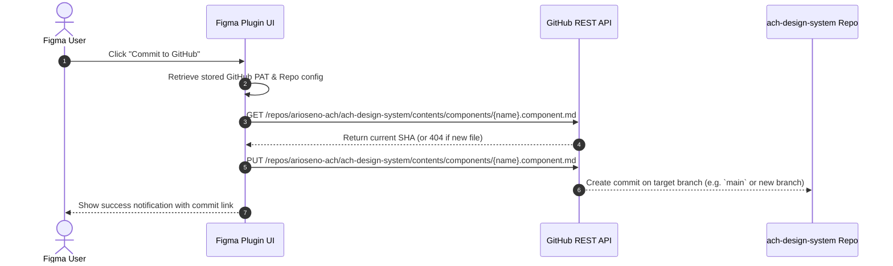

# Product Requirement Document (PRD)
## Figma Plugin: ACH Agentic Spec & Token Exporter

- **Product Name**: ACH Figma-to-Spec Exporter (`ach-figma-plugin`)
- **Author**: Ario Seno & Antigravity
- **Target Repository**: [`arioseno-ach/ach-design-system`](https://github.com/arioseno-ach/ach-design-system)
- **Status**: Draft / Ready for Implementation
- **Version**: 1.0.0

---

## 1. Executive Summary & Problem Statement

### The Problem
In the **ACH Design System**, the single source of truth for AI agents (Cursor, Antigravity, Claude, Copilot) consists of:
1. W3C DTCG Token Dictionary ([`tokens/tokens.json`](../tokens/tokens.json))
2. Structured Markdown Component Specifications with YAML frontmatter & TypeScript contracts ([`components/_template.md`](../components/_template.md))

Currently, designers build components and tokens in **Figma**, but bridging them to this repository requires **manual transcription**:
- Copying hex codes, padding numbers, and variant names by hand.
- Writing markdown tables, TypeScript interfaces, and token mapping manually.
- **Risk**: High friction, human error, stale documentation, and AI hallucination due to out-of-sync specs.

### The Solution
Build a lightweight **Figma Plugin** that inspects Figma Variables and Component Sets with a single click and automatically generates:
1. **`tokens.json`**: Formatted according to W3C Design Token Community Group (DTCG).
2. **`{name}.component.md`**: Formatted exactly according to `components/_template.md` with YAML frontmatter, TypeScript props contract, token mapping, and variant anatomy.

---

## 2. Goals & Non-Goals

### Goals (In Scope)
- **1-Click Token Export**: Read all Figma Local Variables (Colors, Spacing, Radius, Typography) and serialize them into DTCG-compliant `tokens.json`.
- **1-Click Component Spec Export**: Select any Figma `ComponentSet` or `Component` and automatically generate an Agent-Ready Markdown file (`{name}.component.md`).
- **Variable-to-Token Binding Detection**: Detect if a component's padding, fill, or radius is bound to a Figma Variable, and automatically resolve it to its token name (e.g. `color.brand.500`, `space.16`).
- **Interactive Plugin UI**: Tabbed interface with live syntax-highlighted preview, "Copy to Clipboard", and "Download File" buttons.
- **Direct GitHub Sync (Phase 2)**: Push exported files directly to the `ach-design-system` GitHub repository using the GitHub API.

### Non-Goals (Out of Scope)
- Rendering live HTML/React DOM previews inside Figma.
- Two-way synchronization (Code $\to$ Figma). Figma remains the single upstream source of visual truth.

---

## 3. User Personas & Core Workflows

### Personas
1. **Product Designer**: Wants design tokens and components immediately available to engineering without having to write markdown manually.
2. **Design System Engineer / Tech Lead**: Wants guaranteed consistency between Figma components and the markdown contracts read by AI agents.

### User Journey 1: Exporting Component Specification
1. Designer selects a component set (e.g., `Button` with all variants) in Figma canvas.
2. Designer launches the plugin $\to$ Plugin automatically detects selection: `Button (ComponentSetNode with 24 variants)`.
3. Designer clicks **"Generate Component Spec"**.
4. The plugin analyzes properties, variants, auto layout, and bound variables, then outputs the markdown in the preview window.
5. Designer clicks **"Copy Markdown"** (or **"Save as button.component.md"**).
6. File is placed in `ach-design-system/components/`.

### User Journey 2: Exporting Design Tokens
1. Designer opens plugin and switches to **"Tokens"** tab.
2. Plugin lists collections: `Primitives`, `Semantics`, `Spacing`, `Radii`.
3. Designer clicks **"Export tokens.json"**.
4. Designer copies or downloads the JSON file to replace `tokens/tokens.json`.

---

## 4. Functional Requirements & Specifications

### 4.1. Module A: Token Extractor (`tokens.json`)

| Req ID | Requirement | Description |
| :--- | :--- | :--- |
| **TOK-01** | Variable Fetching | Read all local variables using `figma.variables.getLocalVariablesAsync()` and collections via `figma.variables.getLocalVariableCollectionsAsync()`. |
| **TOK-02** | Type Mapping | Map Figma Variable types to DTCG `$type`: <br>• `COLOR` $\to$ `color`<br>• `FLOAT` (dimensions) $\to$ `dimension` with `px` suffix<br>• `FLOAT` (unitless) $\to$ `number` |
| **TOK-03** | Path Hierarchy | Convert Figma slash naming (e.g., `color/brand/500` or `space/16`) into nested JSON objects: `{"color": {"brand": {"500": {"$value": "#1F4EA3", "$type": "color"}}}}`. |
| **TOK-04** | Value Normalization | Convert RGBA (0-1 floats in Figma) to `#RRGGBB` or `#RRGGBBAA` hex string. |
| **TOK-05** | DTCG Schema Metadata | Include `$schema` and `meta` root properties matching `tokens/tokens.json`. |

---

### 4.2. Module B: Component Spec Generator (`.component.md`)

When a `ComponentSetNode` or `ComponentNode` is selected:

#### 1. YAML Frontmatter Extraction
The plugin must parse and output:
```yaml
---
id: {kebab-case-name}
name: {PascalCaseName}
category: {primitive|layout|feedback|navigation} # User selectable or inferred
figma_component_name: "{Exact Figma Node Name}"
figma_url: "https://www.figma.com/design/.../?node-id={node.id}"
status: draft
tokens_used:
  # Inferred list of unique bound tokens detected across all variants
---
```

#### 2. Code Contract (TypeScript Interface Generation)
- Read `node.componentPropertyDefinitions` (Variants, Booleans, Text, Instance Swap).
- Generate a clean TypeScript interface:
  - Variant properties $\to$ union types (e.g., `variant?: 'primary' | 'secondary' | 'destructive'`).
  - Boolean properties $\to$ boolean types (e.g., `loading?: boolean`, `disabled?: boolean`).
  - Text properties $\to$ `string` or `React.ReactNode`.
  - Add standard JSDoc descriptions.

#### 3. Variants Table
- Generate a markdown table listing all variant axes and their possible values:
  ```markdown
  | Variant / Prop | Values | Default | Purpose |
  | :--- | :--- | :--- | :--- |
  ```

#### 4. Anatomy Extraction
- Inspect the default variant's visual layer hierarchy (`children` of the node):
  - In Auto Layout components, detect leading icons, labels, trailing icons, badges.
  - Generate an ASCII diagram or structured list representing the anatomy.

#### 5. Design Tokens Mapping Table
- Traverse layer properties (`fills`, `strokes`, `paddingTop`, `paddingLeft`, `cornerRadius`).
- Inspect `boundVariables` (e.g. `node.boundVariables.fills`, `node.boundVariables.paddingLeft`).
- If bound to a variable, resolve the variable's full name to token notation (e.g., `Variable "space/12"` $\to$ `space.12` / `var(--ach-space-12)`).
- Populate the Token Mapping table.

#### 6. States Matrix
- Look for a variant property named `State`, `Status`, or `Interaction`.
- Ensure all 6 required states are documented:
  1. Default
  2. Hover
  3. Pressed / Active
  4. Focus
  5. Disabled
  6. Loading

#### 7. Do's & Don'ts Boilerplate
- Inject standard strict agent guidelines (No hardcoded hex, provide helper text for disabled state, single primary action).

---

### 4.3. Module C: Plugin UI & Export Actions

- **Dimensions**: Fixed 440px width, 580px height.
- **Tabs**:
  1. **Component Spec**: Shown when a component is selected. Live markdown viewer with syntax formatting.
  2. **Tokens**: Shown on demand. Lets user select variable collections to export.
  3. **Settings**: Config for GitHub PAT and repository target.
- **Action Buttons**:
  - `Copy to Clipboard`: Copies raw markdown or JSON.
  - `Download .md / .json`: Triggers browser file download.
  - `Push to GitHub (Phase 2)`: Direct commit via GitHub API.

---

## 5. Technical Architecture & Figma Plugin API Reference

### 5.1. Tech Stack
- **Runtime**: Figma Plugin Sandbox (JavaScript / TypeScript).
- **UI Framework**: Vanilla HTML/CSS or lightweight Preact/React with Figma Plugin DS styles.
- **Compiler**: Vite or esbuild.

### 5.2. Core Figma API Endpoints Used

```typescript
// 1. Fetching Variables
const collections = await figma.variables.getLocalVariableCollectionsAsync();
const variables = await figma.variables.getLocalVariablesAsync();

// 2. Inspecting Selection
const selection = figma.currentPage.selection[0];
if (selection.type === 'COMPONENT_SET') {
  const propDefs = selection.componentPropertyDefinitions;
  const defaultVariant = selection.defaultVariant;
  // Inspect children and boundVariables
}

// 3. Resolving Bound Variables
function resolveVariableToken(variableId: string): string {
  const variable = figma.variables.getVariableById(variableId);
  return variable ? variable.name.replace(/\//g, '.') : 'unbound';
}
```

### 5.3. Color Conversion Utility
Figma stores RGB colors as decimals between 0 and 1:
```typescript
function figmaRgbToHex(color: RGB, opacity: number = 1): string {
  const r = Math.round(color.r * 255).toString(16).padStart(2, '0');
  const g = Math.round(color.g * 255).toString(16).padStart(2, '0');
  const b = Math.round(color.b * 255).toString(16).padStart(2, '0');
  return `#${r}${g}${b}`.toUpperCase();
}
```

---

## 6. GitHub Integration Architecture (Phase 2)

To enable 1-click publishing directly from Figma to `ach-design-system`:



---

## 7. Implementation Roadmap & Milestones

| Milestone | Deliverables | Target Timeline |
| :--- | :--- | :--- |
| **M1: Plugin Scaffold** | Initialize Figma plugin project (`manifest.json`, Vite, TypeScript setup, basic tabbed UI). | Day 1-2 |
| **M2: Token Extractor** | Extract all Local Variables $\to$ DTCG JSON format $\to$ Copy/Download. | Day 3-4 |
| **M3: Component Parser** | Parse `ComponentSetNode`, variants, auto-layout, bound variables $\to$ Generate `.component.md` matching template. | Day 5-7 |
| **M4: Polish & Testing** | Test on Button, Input, Modal in Figma. Edge-case handling (unbound styles, non-auto-layout). | Day 8-9 |
| **M5: GitHub API Sync** | Add GitHub PAT settings and direct commit endpoint. | Day 10 |

---

## 8. Acceptance Criteria

- [ ] Selecting any `ComponentSetNode` in Figma outputs markdown that strictly matches [`components/_template.md`](../components/_template.md).
- [ ] Frontmatter contains valid YAML with `id`, `name`, `figma_component_name`, and `tokens_used`.
- [ ] All Figma Variable bindings (`color/*`, `space/*`, `radius/*`) are correctly translated to `color.*`, `space.*`, and `var(--ach-*)`.
- [ ] Exported tokens from Figma match the structure of [`tokens/tokens.json`](../tokens/tokens.json).
- [ ] An AI agent (Cursor, Antigravity, Claude) can read the generated markdown file and immediately generate compliant frontend components with zero manual corrections.
