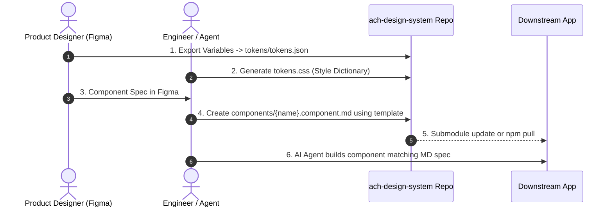

# ACH Design System — Practical Integration Guide

This guide explains how to practically consume and reference **`ach-design-system`** in other frontend projects (e.g., Next.js, Vite, React, Vue, or Monorepos) and how to configure AI coding assistants (Cursor, Antigravity, Claude Code, GitHub Copilot) to use it as their single source of truth.

---

## 1. Integration Architectures

Depending on your engineering setup, you can consume this repository using one of the following approaches:

```
┌────────────────────────────────────────────────────────┐
│               ach-design-system Repo                   │
│   (Tokens JSON, CSS, Markdown Specs, Business Rules)   │
└───────────────────────────┬────────────────────────────┘
                            │
       ┌────────────────────┼────────────────────┐
       ▼                    ▼                    ▼
【Approach A】         【Approach B】        【Approach C】
 Git Submodule         Agent Rules           Tokens / CSS Package
(Full specs in repo)   (Prompt reference)    (Runtime styles)
```

---

## Approach A: Git Submodule (Recommended for Full Agent Context)

Linking `ach-design-system` as a Git submodule allows AI agents running in your downstream application to directly read markdown specs, token files, and patterns without leaving the project workspace.

### Step 1: Add the Submodule
In the root of your frontend application repository:
```bash
git submodule add https://github.com/arioseno-ach/ach-design-system.git docs/design-system
git submodule update --init --recursive
```

### Step 2: Import Tokens into Your App
In your frontend entry point (e.g., `src/index.css` or `app/globals.css`):
```css
/* Import design system tokens directly */
@import "../docs/design-system/tokens/tokens.css";
```

### Step 3: Keep Specs Synchronized
When design specs are updated in `ach-design-system`:
```bash
git submodule update --remote --merge
```

---

## Approach B: AI Assistant Configuration

Configure your AI coding assistant in downstream projects to automatically pull rules from `ach-design-system`.

### 1. Cursor Setup (`.cursor/rules/`)
Create a rule file in your downstream project at `.cursor/rules/ach-design-system.mdc`:

```markdown
---
description: Enforce ACH Design System rules when generating UI or components
globs: ["**/*.tsx", "**/*.jsx", "**/*.vue", "**/*.css", "**/*.html"]
alwaysApply: true
---

# ACH Design System Directives

When writing or modifying UI components, layouts, or styles:
1. Adhere strictly to the design system in `docs/design-system/` (or https://github.com/arioseno-ach/ach-design-system).
2. Read `docs/design-system/AGENTS.md` before generating any code.
3. NEVER write hardcoded hex colors or arbitrary px values. Use CSS custom properties:
   - Primary brand: `var(--ach-color-brand-500)`
   - Text: `var(--ach-color-neutral-900)`
   - Background: `var(--ach-color-neutral-50)`
   - Radius: `var(--ach-radius-md)`
4. For components (Button, Input, Stepper), follow the contracts in `docs/design-system/components/`.
5. Check `docs/design-system/business-context/brand-voice.md` for terminology and action verbs.
```

### 2. Antigravity IDE Setup (`.agents/skills/`)
In your project's `.agents/skills/ach-design-system/SKILL.md`:
```yaml
---
name: ach-design-system
description: Guides the agent on implementing UI following the ACH Design System standards, tokens, and components.
---

Refer to `docs/design-system/AGENTS.md` and component specs in `docs/design-system/components/` whenever creating or updating UI elements.
```

---

## Approach C: Tailwind CSS Integration

If your downstream project uses Tailwind CSS, you can map the design tokens directly into your `tailwind.config.js`:

```javascript
// tailwind.config.js
/** @type {import('tailwindcss').Config} */
module.exports = {
  content: ['./src/**/*.{js,ts,jsx,tsx}'],
  theme: {
    extend: {
      colors: {
        ach: {
          brand: {
            100: 'var(--ach-color-brand-100)',
            500: 'var(--ach-color-brand-500)',
            600: 'var(--ach-color-brand-600)',
          },
          neutral: {
            0: 'var(--ach-color-neutral-0)',
            50: 'var(--ach-color-neutral-50)',
            100: 'var(--ach-color-neutral-100)',
            200: 'var(--ach-color-neutral-200)',
            600: 'var(--ach-color-neutral-600)',
            900: 'var(--ach-color-neutral-900)',
          },
          feedback: {
            success: 'var(--ach-color-feedback-success)',
            warning: 'var(--ach-color-feedback-warning)',
            danger: 'var(--ach-color-feedback-danger)',
          },
        },
      },
      borderRadius: {
        'ach-sm': 'var(--ach-radius-sm)',
        'ach-md': 'var(--ach-radius-md)',
        'ach-lg': 'var(--ach-radius-lg)',
      },
      spacing: {
        'ach-4': 'var(--ach-space-4)',
        'ach-8': 'var(--ach-space-8)',
        'ach-12': 'var(--ach-space-12)',
        'ach-16': 'var(--ach-space-16)',
        'ach-24': 'var(--ach-space-24)',
        'ach-32': 'var(--ach-space-32)',
      },
    },
  },
  plugins: [],
};
```

---

## 2. Figma-to-Repo Practical Workflow

When extracting styles and components from Figma into this repository:



### 1. Extracting Tokens (Colors, Spacing, Typography)
1. In Figma, open **Local Variables**.
2. Export variables as JSON (using **Tokens Studio for Figma** or the native Figma Variables Export).
3. Save/merge into [`tokens/tokens.json`](../tokens/tokens.json).
4. Run your token compilation to generate [`tokens/tokens.css`](../tokens/tokens.css).

### 2. Extracting Components
1. Copy [`components/COMPONENT_TEMPLATE.md`](../components/COMPONENT_TEMPLATE.md).
2. Name the file `components/{component-name}.component.md`.
3. Fill in:
   - **Frontmatter**: Component ID, name, status, tokens used.
   - **Code Contract**: TypeScript interface (`interface Props`), states, and CSS/Tailwind class mapping.
   - **Figma Specs**: Anatomy, padding, spacing, and icon positions.
   - **Do & Don't**: Concrete code examples of correct vs forbidden usage.
4. Register the new component in [`components/components.md`](../components/components.md).

---

## 3. Developer & Agent Routine (How to Build a Screen)

When an engineer or AI agent is tasked with building a new screen:

1. **Check Template**: Is this screen an Onboarding flow or a Wizard? Look at `templates/wizard.template.md`.
2. **Check Patterns**: Does it need a Top Bar and Bottom Bar? Look at `patterns/`.
3. **Assemble Components**: Use verified primitives from `components/`.
4. **Validate Verbs & Copy**: Consult `business-context/brand-voice.md` (e.g., use "Continue" instead of "Next").
5. **Linting**: Ensure no inline `#hex` colors or unmapped `px` values exist in the generated code.
